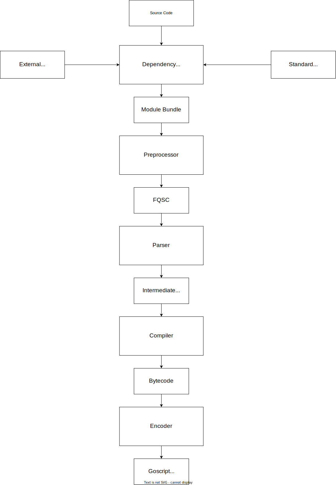

# goscript
productivity oriented, AOT compiled, platform independent scripting language written in golang

[TOC]

# 1. Goals & Architecture
## 1.1 Motivation & Goals
## 1.2 Architecture

# 2. Language Specification
## 2.1 Program Structure
## 2.2 Imports & Scoping
## 2.3 Types
## 2.4 Keywords
## 2.5 Builtins
## 2.6 Error Handling
## 2.7 Asynchronous Programming

# 3. Runtime & Bytecode
## 3.1 Symbols & Symbol Table
## 3.2 Scope Stack
## 3.3 Expressions
## 3.4 Instruction Set

# 4. Compiler
## 4.1 Architecture

# 5. Encoding
## 5.1 Considered Encodings
## 5.2 Encodings Benchmark
## 5.3 Protocol Buffers (+Snappy/Z-Standard)
